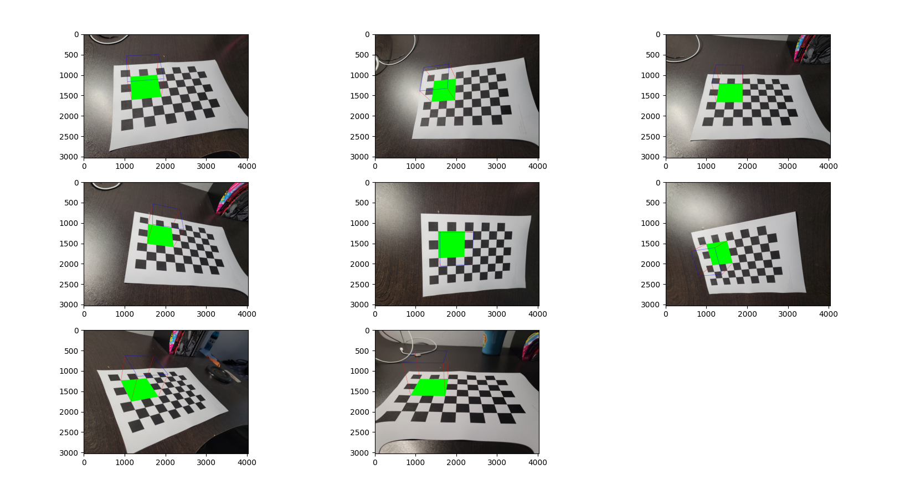
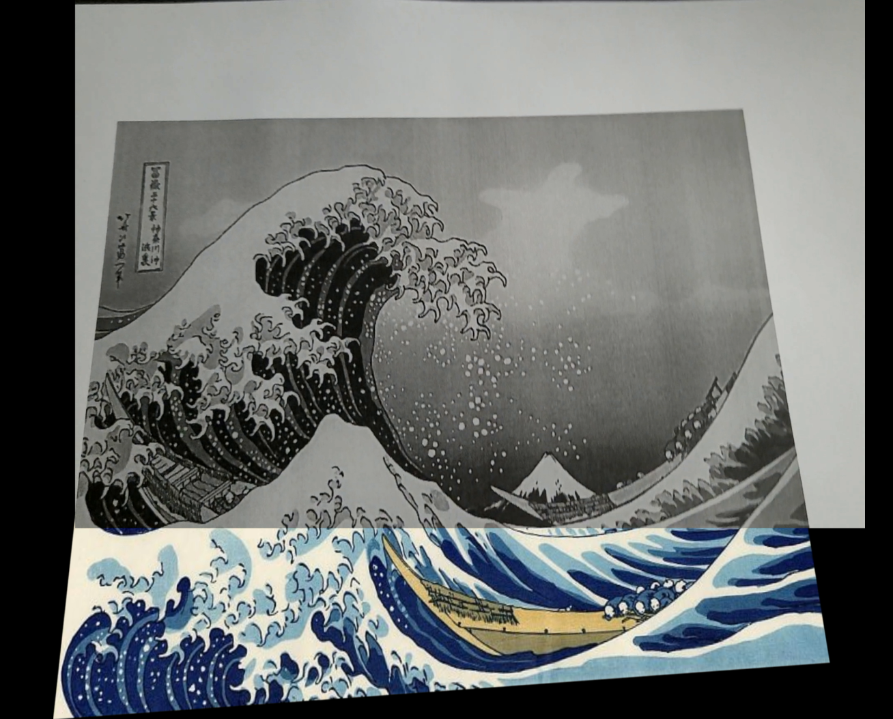

# AR-Feature-Matching

#### <ins>The Goal</ins> : Render a 3D object onto a 2D image, and create an AR experience, Using Geometric Transformations, Camera Calibration, and Feature Matching (SIFT).
-----------
#### <ins>Process </ins> :
- First, We calibrate the camera (Samsung Galaxy s20) using a printed chessboard image, and open-cv, and get the camera intrinsics + distortion coefficients:

  - ##### (Visual check for the calibration output (map a 3D cube onto the 2D chessboard))
- Next, choose a template image to print, that will be used as our projection plane, and feature match between the template image and the printed image.
  - After using the SIFT algorithm, and exracting keypoints from template and printed images, we find Homography between the 2, and take only the pixels that obey homography between the two images.
  
- After we got the points, we then convert the template points to real-world coordinates, and estimate a rotation vector and translation vector, between the matched frame's points, and the real-world coordinates.
- Using the vectors from above, we finally project the 3D object's points onto the image frame, and render the object.
